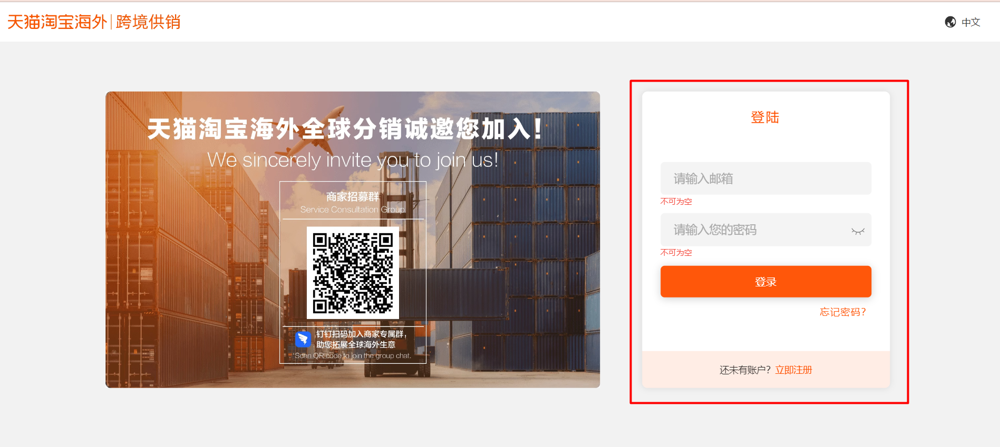
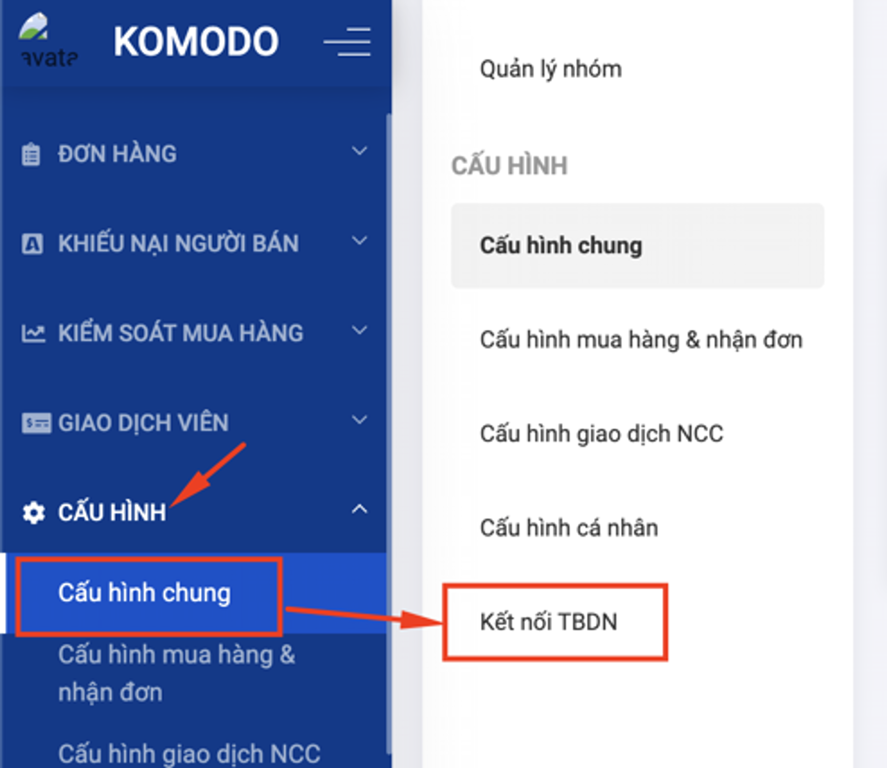
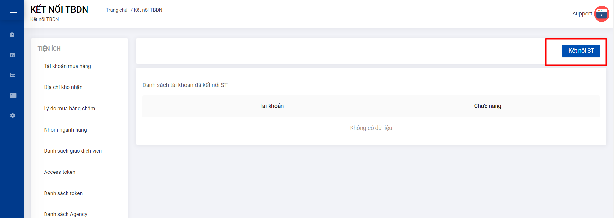
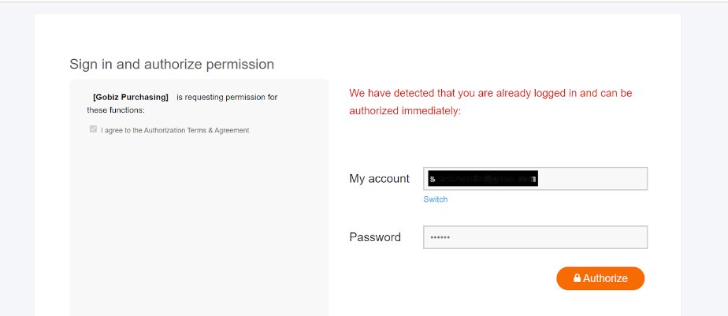
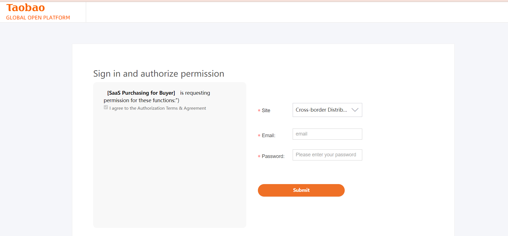

Để kết nối tài khoản Taobao Global vào hệ thống cần thực hiện các bước sau 

**Bước 1:** Đăng nhập vào tài khoản Taobao Global đã tạo trước đó tại liên kết này:

 https://distributor.taobao.global/apps/seller/login?

**Bước 2:** Truy cập menu trên hệ thống Mua hàng Mục Cấu hình Gobiz mục **“Cấu hình chung”**

Truy cập **"Kết nối TB Global"**

Click vào **"Kết nối ST "**

Bước 3: Điền tài khoản, mật khẩu. Click **Authorize**

Nếu chưa đăng nhập ở Bước 1 thì đăng nhập thêm ở bước này và Click **Submit**

Kết nối thành công hệ thống tự động chuyển sang **Dashboard** 
