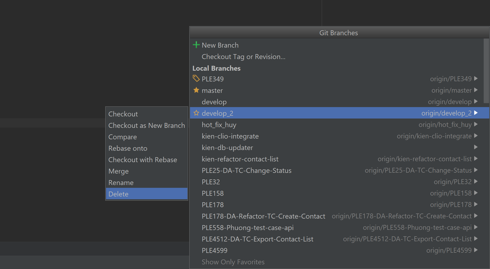
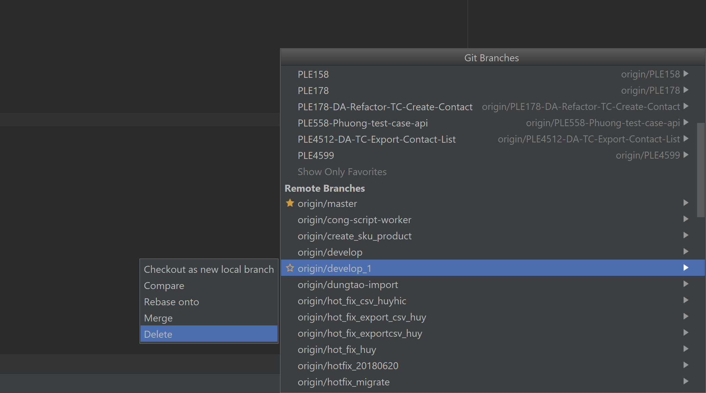

# Hướng dẫn build Develop

## Build phiên bản test cho từng branch riêng rẽ

Bước 1: Check xem hai branch dùng cho việc test branch là develop_1 và develop_2 có ai đang dùng để test branch nào hay không.

Bước 2: Nếu cả hai branch đều đang bận, thôi chờ khi khác nhé, Tester không test quá nhiều thứ một lúc như vậy được. Hà Nội không vội được đâu.

Nếu còn một branch đang rãnh rỗi. Ví dụ ở đây tôi sẽ dùng develop_2. Branch tôi muốn test sẽ là PLE349.

Tiếp theo sẽ có hai cách thao tác: xóa rồi tạo mới hoặc force push. Tôi khuyến cáo nên sử dụng phương pháp xóa rồi tạo mới nên sẽ không hướng dẫn cách force push. Tôi cũng sẽ chỉ hướng dẫn thao tác trên IDE, các bạn nếu pro git đảm bảo không làm sai được thì có thể dùng lệnh, còn nếu không đủ pro thì tốt nhất dụng IDE.

Bước 3: Drop branch develop_2 trên remote.

*CHÚ Ý: DROP CẢ LOCAL LẪN REMOTE ĐỂ ĐẢM BẢO CHÍNH XÁC*

Xóa branch develop_2 trên local bằng IDE:

IDE sẽ hỏi bạn xem có muốn xóa remote branch không:

Chỉ cần bạn đồng ý bằng cách ấn vào Delete

Là sau đó branch trên remote sẽ được xóa tương ứng.

Còn nếu IDE của bạn quá dốt không biết đường xóa branch remote cùng với branch local thì cũng không sao. Bạn có thể tự xóa remote bằng cách thực hiện như sau:

Bước 4: Tạo branch develop_2 từ branch PLE349 và push lên git.

Bước 5: (Chỉ áp dụng cho lần đầu build nhánh develop mà bạn mới tạo) Tạo một commit mới trên branch develop_2 với nội dung bất kỳ để hệ thống nhận diện là cần phải build.

Bước 6: Ngồi chờ một lúc và branch của bạn sẽ được build trên nhánh tương ứng.

LƯU Ý:

- Để build lần tiếp theo, bạn chỉ cần merge branch PLE349 vào develop_2 và push lên là được
- Sau khi test mà có bug, các fix bạn cũng làm trên PLE349, *tuyệt đối không làm gì trên develop_2* trừ việc commit để build
- Để push commit mà không build chỉ cần đặt trong commit message "#no-build"

Sau khi build xong, chatbot DingTalk sẽ hú lên trong group Táo Bạo.