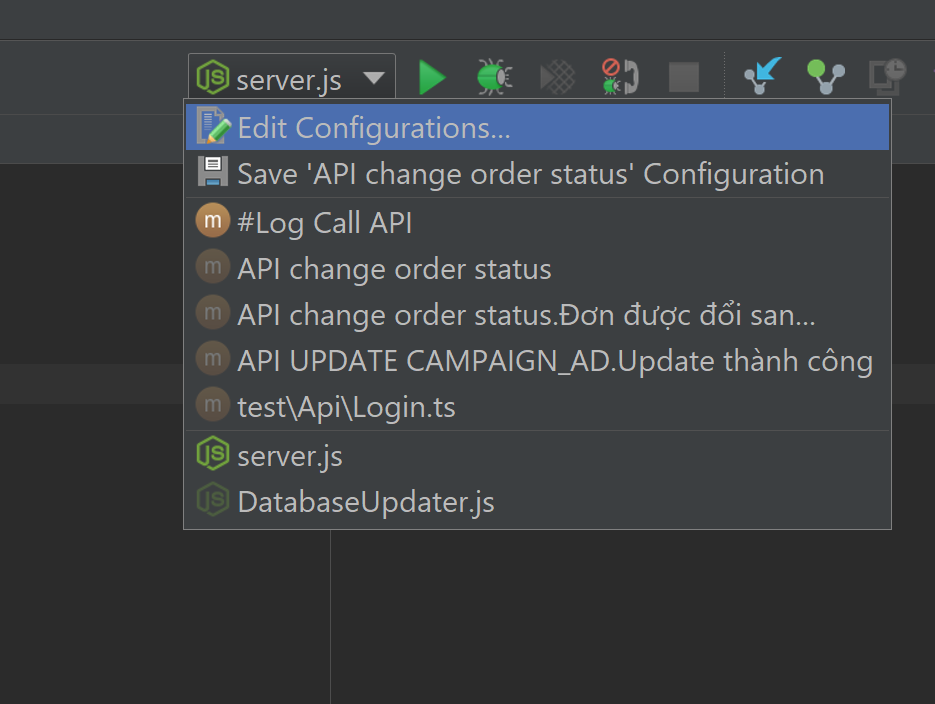

# Setup biến môi trường trên IDE

Bước 1: Mở Debug & Run configuration bằng cách click vào edit configurations

Bước 2: Click vào Environment Variables

Bước 3: Thêm/sửa/xóa các biến môi trường, có thể paste từ file .env vào bằng cách sử dụng icon "Paste trên cửa sổ này"
